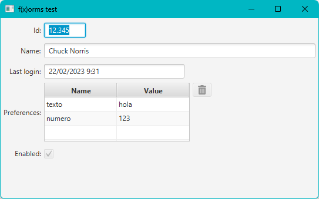

# f(x)orms

 JavaFX form builder.

## How to build a form

1. Create your JavaFX bean:
   
   ```java
   public class User {
   
       @ReadOnly
       private IntegerProperty id = new SimpleIntegerProperty();
   
       private StringProperty name = new SimpleStringProperty();
   
       @ReadOnly
       private ObjectProperty<LocalDateTime> lastLogin = new SimpleObjectProperty<>();
   
       private MapProperty<String, Object> preferences = new SimpleMapProperty<>(FXCollections.observableHashMap());
   
       private ReadOnlyBooleanWrapper enabled = new ReadOnlyBooleanWrapper();
   
       public final IntegerProperty idProperty() {
           return this.id;
       }
   
       public final int getId() {
           return this.idProperty().get();
       }
   
       public final void setId(final int id) {
           this.idProperty().set(id);
       }
   
       public final StringProperty nameProperty() {
           return this.name;
       }
   
       public final String getName() {
           return this.nameProperty().get();
       }
   
       public final void setName(final String name) {
           this.nameProperty().set(name);
       }
   
       public final ObjectProperty<LocalDateTime> lastLoginProperty() {
           return this.lastLogin;
       }
   
       public final LocalDateTime getLastLogin() {
           return this.lastLoginProperty().get();
       }
   
       public final void setLastLogin(final LocalDateTime lastLogin) {
           this.lastLoginProperty().set(lastLogin);
       }
   
       public final MapProperty<String, Object> preferencesProperty() {
           return this.preferences;
       }
   
       public final ObservableMap<String, Object> getPreferences() {
           return this.preferencesProperty().get();
       }
   
       public final void setPreferences(final ObservableMap<String, Object> preferences) {
           this.preferencesProperty().set(preferences);
       }
   
       public final javafx.beans.property.ReadOnlyBooleanProperty enabledProperty() {
           return this.enabled.getReadOnlyProperty();
       }
   
       public final boolean isEnabled() {
           return this.enabledProperty().get();
       }
   
   }
   ```

2. Build your form at runtime:
   
   ```java
   Form<User> form = new FormBuilder<>(User.class).build();
   ```

> You can register your own custom adapters with `registerFieldAdapter(x)` method to render the bean properties as specific UI components.

4. Add it to your view:
   
   ```java
   stage.setTitle("f(x)orms test");
   stage.setScene(new Scene(form));
   stage.show();
   ```

5. Bind a bean to the form:
   
   ```java
   User user = new User();
   [...]
   form.bind(user);
   ```

    A this is the result:

    
